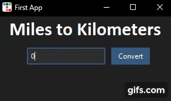

# Miles to KM

## Problem Description

This app was done followed [this](https://www.youtube.com/watch?v=mop6g-c5HEY&ab_channel=ClearCode) tutorial on tkinter.

Simple app that takes a number from user, representing miles, and outputs it back as kilometers.

The purpose of this app was to quickly build an app with GUI, so no error-handling was done.

## Example

## Usage

1. Run 'python demo.py'
2. Type a number in the entry-box
3. Click on 'convert'